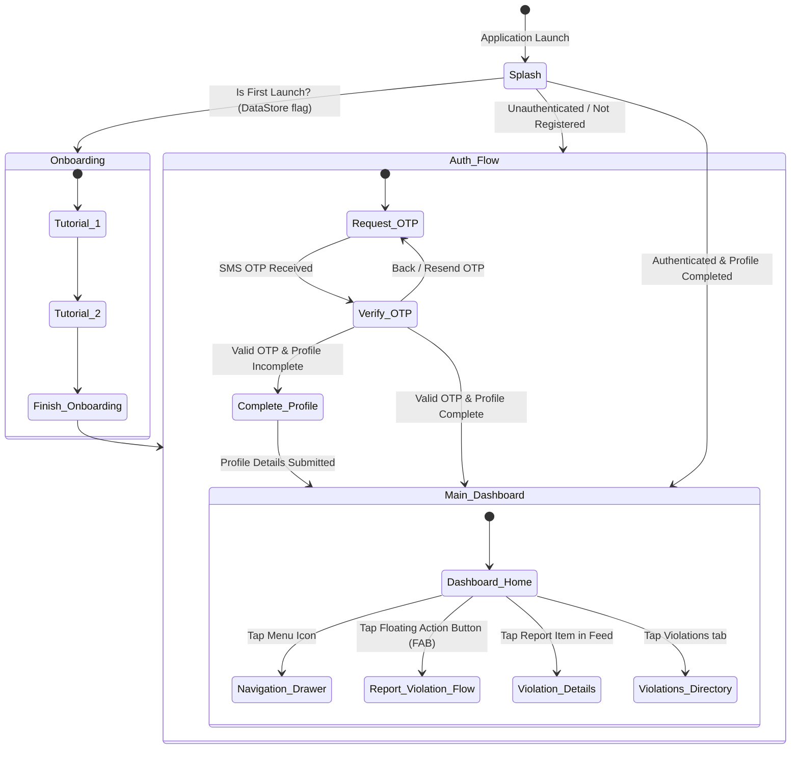
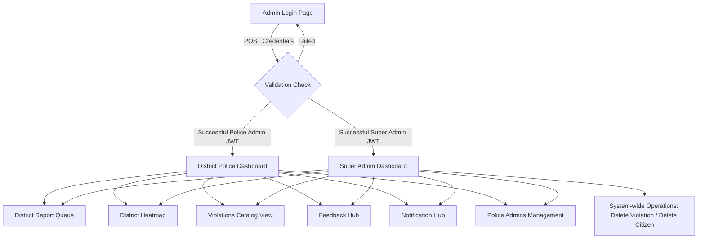

# Application Flow Document (App Flow) 🛡️
## Project: Axom Prahari (The Civic Sentinel)

This document maps out the end-to-end navigational flows, state transitions, and business logic paths for both the Citizen Android Application and the Web Admin Dashboard.

---

## 1. Citizen Mobile Application Flow (Android)

The citizen application navigation graph is controlled by a root state check in `RootNavigationGraph` which divides the application into three major phases: **Loading (Splash)**, **Unauthenticated (Auth/Onboarding)**, and **Authenticated (Core App)**.

### 1.1 First Launch & Auth Screen Details

#### 1.1.1 Onboarding Flow (`OnboardingScreen`)
*   **Trigger:** Absence of onboarding completion flag in DataStore.
*   **Visuals:** Horizontal carousel demonstrating the app's utility (Capture Violation, Submit Geotagged Media, Track Status & Rewards).
*   **Action:** Clicking "Get Started" stores the completion flag and transitions to the `RequestOtp` route.

#### 1.1.2 Request OTP Flow (`RequestOtpScreen`)
*   **Inputs:** 10-digit mobile number.
*   **Action:** Submitting calls `/api/v1/auth/citizen/request-otp`. If successful, redirects to `VerifyOtp` route passing the phone number as a parameter.
*   **Links:** Direct navigation buttons to Guidelines & FAQ, Privacy Policy, and Terms of Service.

#### 1.1.3 Verify OTP Flow (`VerifyOtpScreen`)
*   **Inputs:** 6-digit SMS OTP.
*   **Action:** Calls `/api/v1/auth/citizen/verify-otp`.
*   **Transitions:**
    *   If profile status is `incomplete`, redirects user to `CompleteProfileScreen`.
    *   If profile status is `completed`, sets JWT in local storage, logs user in, and targets `DashboardScreen`.

#### 1.1.4 Complete Profile Flow (`CompleteProfileScreen`)
*   **Inputs:** Full Name, unique Username, and Email.
*   **Action:** Calls `/api/v1/auth/citizen/complete-profile` with temp JWT token. Once details are written, sets active JWT and redirects to `DashboardScreen`.

---

### 1.2 Core App Navigation Flow (Authenticated)

Once logged in, the application shows a persistent Navigation Drawer containing links to:
*   **Dashboard** (Home Feed)
*   **My Reports** (Personal Submissions Log)
*   **Violations Catalog** (Standard penalty details)
*   **My Profile** (Account stats and profile editor)
*   **Guidelines & FAQs** (Instructions on reporting)
*   **Feedback Screen** (Submit app/system feedback)
*   **Logout Action** (Blacklists JWT and returns to Auth Flow)

#### 1.2.1 Violation Reporting Flow (`ReportOffenceScreen`)
This is the core user transaction flow:
1.  **Initiation:** Citizen clicks the camera icon or "Report" FAB on the Dashboard.
2.  **Evidence Selection:**
    *   CameraX initializes. User must record a video or take a photo.
    *   App verifies file structure and displays preview.
3.  **Metadata Capture:**
    *   GPS location coordinates (lat/long) are fetched automatically via LocationManager API.
    *   Reverse geocoding resolves the nearest location name (e.g., "G.S. Road, Christian Basti, Guwahati").
    *   User inputs: Vehicle Registration Number, description of the incident, and selects the violation type from a dropdown.
4.  **Submission Engine:**
    *   App requests an upload token: `GET /api/v1/citizen/reports/presigned-url`.
    *   App uploads compressed media directly to Cloudflare R2 bucket.
    *   App submits metadata and file key: `POST /api/v1/citizen/reports`.
    *   Redirects back to Dashboard with a success Toast.

#### 1.2.2 My Reports Status Flow (`ReportScreen`)
*   Shows a list of the user's submitted reports grouped by Status: `All`, `Pending`, `Accepted`, `Rejected`.
*   Clicking a report opens `ReportDetailScreen` showing full report metadata, S3 media player, and the official police administrator's feedback message if rejected or accepted.

---

## 2. Web Admin Dashboard Flow (Next.js)

The admin portal is a secure, role-restricted dashboard intended for Police Officers and State Super Administrators.

### 2.1 Admin Authentication Flow
*   **Endpoint:** `/api/v1/auth/admin/login` (email & password).
*   **Auth State:** Set in Next.js session contexts or cookies.
*   **Boundary Gate:** If a user tries to access `/admin/*` without an active, non-expired token, middleware redirects them to `/login`.

### 2.2 Police Administrator Flow (District Scoped)
1.  **Dashboard Hub:** Displays metrics (Total pending, accepted, and rejected reports within the officer's district).
2.  **Violations Reports Console:**
    *   Browse list of reports filterable by Status, District, and Incident Date.
    *   Open Report Viewer modal to play/view media evidence.
    *   Enter verification feedback and click **Accept** (which allocates points to the citizen and updates status) or **Reject** (which updates status and logs rejection reason).
3.  **Violations Registry:** Read, Create, and Edit traffic violations.
4.  **Citizens Directory:** View citizen users list, search by Username or custom Citizen ID, and toggle active status (Suspend/Enable) for abusive users.
5.  **Officer Management:** Create and edit other Police Admin accounts.

### 2.3 Super Administrator Flow (Global Scoped)
Inherits all Police Admin workflows, plus:
1.  **Permanent Deletions:**
    *   Can permanently delete citizen accounts from the database.
    *   Can permanently delete violation listings from the master catalog.
    *   Can permanently delete administrative accounts.
2.  **Global Admin Control:** Can onboard new Super Admins or change permissions for admins in any jurisdiction district of Assam.
