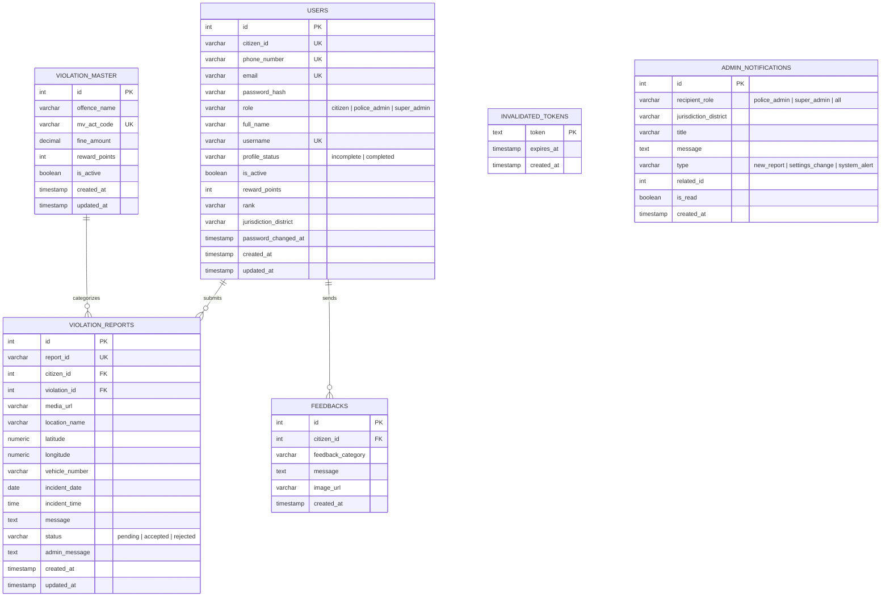

# Backend Database Schema Document 🛡️
## Project: Axom Prahari (The Civic Sentinel)

This document details the relational database schema implemented in PostgreSQL, highlighting tables, column constraints, data types, indexes, and relationships.

---

## 1. Entity Relationship Overview

The database contains 6 relational tables that track users, login tokens, violation listings, report submissions, administrative alerts, and citizen feedback.



---

## 2. Table Specifications

### 2.1 Table: `users`
Tracks both citizen accounts and administrative users (Police Admins and Super Admins).

| Column Name | Data Type | Constraints / Default | Description |
| :--- | :--- | :--- | :--- |
| `id` | `SERIAL` | `PRIMARY KEY` | Auto-incrementing identifier. |
| `citizen_id` | `VARCHAR(50)` | `UNIQUE`, `NULLABLE` | Unique user-friendly code. Format: `APC-[Alphanumeric]`. |
| `phone_number` | `VARCHAR(15)` | `UNIQUE`, `NULLABLE` | Citizen phone number used for SMS OTP login. |
| `email` | `VARCHAR(255)` | `UNIQUE`, `NULLABLE` | Admin email or completed citizen email. |
| `password_hash` | `VARCHAR(255)` | `NULLABLE` | BCrypt hash of administrator's password (null for citizens). |
| `role` | `VARCHAR(50)` | `NOT NULL`, `CHECK (role IN ('citizen', 'police_admin', 'super_admin'))` | Security role of the account. |
| `full_name` | `VARCHAR(255)` | `NULLABLE` | Full name of the citizen or administrator. |
| `username` | `VARCHAR(100)` | `UNIQUE`, `NULLABLE` | User-defined handle. |
| `profile_status` | `VARCHAR(50)` | `DEFAULT 'incomplete'` | Registration state tracker (`incomplete` / `completed`). |
| `is_active` | `BOOLEAN` | `DEFAULT TRUE` | Soft-deletion or suspension status flag. |
| `reward_points` | `INT` | `DEFAULT 0` | Gamified points accumulated by the citizen. |
| `rank` | `VARCHAR(100)` | `NULLABLE` | Police rank/designation (e.g., DSP, Inspector) - Admin only. |
| `jurisdiction_district` | `VARCHAR(100)` | `NULLABLE` | Assigned Assam district jurisdiction - Admin only. |
| `password_changed_at` | `TIMESTAMP WITH TIME ZONE` | `NULLABLE` | Tracks when the password was updated (session invalidation). |
| `created_at` | `TIMESTAMP WITH TIME ZONE` | `DEFAULT CURRENT_TIMESTAMP` | System record creation timestamp. |
| `updated_at` | `TIMESTAMP WITH TIME ZONE` | `DEFAULT CURRENT_TIMESTAMP` | System record last update timestamp. |

---

### 2.2 Table: `invalidated_tokens`
Stores blacklisted JWT tokens after logout or account state modifications.

| Column Name | Data Type | Constraints | Description |
| :--- | :--- | :--- | :--- |
| `token` | `TEXT` | `PRIMARY KEY` | The JWT token string. |
| `expires_at` | `TIMESTAMP WITH TIME ZONE` | `NOT NULL` | The original expiration time of the JWT token. |
| `created_at` | `TIMESTAMP WITH TIME ZONE` | `DEFAULT CURRENT_TIMESTAMP` | Timestamp when the token was blacklisted. |

---

### 2.3 Table: `violation_master`
Catalog mapping all traffic offenses, legal references, fine sizes, and rewards.

| Column Name | Data Type | Constraints | Description |
| :--- | :--- | :--- | :--- |
| `id` | `SERIAL` | `PRIMARY KEY` | Auto-incrementing identifier. |
| `offence_name` | `VARCHAR(255)` | `NOT NULL` | Name of the violation (e.g., "Triple Riding"). |
| `mv_act_code` | `VARCHAR(100)` | `NOT NULL`, `UNIQUE` | Motor Vehicles Act Code (e.g., "Section 128 MV Act"). |
| `fine_amount` | `DECIMAL(10, 2)` | `NOT NULL` | The standard legal penalty amount. |
| `reward_points` | `INT` | `DEFAULT 0` | Points awarded to citizen upon verification. |
| `is_active` | `BOOLEAN` | `DEFAULT TRUE` | Toggle indicating if reports for this violation are accepted. |
| `created_at` | `TIMESTAMP WITH TIME ZONE` | `DEFAULT CURRENT_TIMESTAMP` | Creation timestamp. |
| `updated_at` | `TIMESTAMP WITH TIME ZONE` | `DEFAULT CURRENT_TIMESTAMP` | Update timestamp. |

---

### 2.4 Table: `violation_reports`
Detailed records of all citizen violation submissions.

| Column Name | Data Type | Constraints | Description |
| :--- | :--- | :--- | :--- |
| `id` | `SERIAL` | `PRIMARY KEY` | Auto-incrementing identifier. |
| `report_id` | `VARCHAR(50)` | `UNIQUE`, `NOT NULL` | Custom ID. Format: `REP-[YYMMDD]-[Random Hex]`. |
| `citizen_id` | `INT` | `FOREIGN KEY` (references `users.id` ON DELETE CASCADE) | The submitting user identifier. |
| `violation_id` | `INT` | `FOREIGN KEY` (references `violation_master.id`) | The categorized violation type identifier. |
| `media_url` | `VARCHAR(500)` | `NOT NULL` | The address of the file stored in Cloudflare R2. |
| `location_name` | `VARCHAR(255)` | `NOT NULL` | Geocoded text/address of the incident. |
| `latitude` | `NUMERIC(10, 7)` | `NOT NULL` | GPS Latitude coordinates. |
| `longitude` | `NUMERIC(10, 7)` | `NOT NULL` | GPS Longitude coordinates. |
| `vehicle_number` | `VARCHAR(50)` | `NOT NULL` | Registration number of offending vehicle. |
| `incident_date` | `DATE` | `NOT NULL` | Date when violation was recorded. |
| `incident_time` | `TIME` | `NOT NULL` | Time when violation was recorded. |
| `message` | `TEXT` | `NULLABLE` | Notes/Description added by reporting citizen. |
| `status` | `VARCHAR(20)` | `DEFAULT 'pending'`, `CHECK IN ('pending', 'accepted', 'rejected')` | Current review state of report. |
| `admin_message` | `TEXT` | `NULLABLE` | Response comments logged by verifying officer. |
| `created_at` | `TIMESTAMP WITH TIME ZONE` | `DEFAULT CURRENT_TIMESTAMP` | Date report was logged. |
| `updated_at` | `TIMESTAMP WITH TIME ZONE` | `DEFAULT CURRENT_TIMESTAMP` | Date report was last updated. |

---

### 2.5 Table: `admin_notifications`
Alerts targeted to dashboard users.

| Column Name | Data Type | Constraints | Description |
| :--- | :--- | :--- | :--- |
| `id` | `SERIAL` | `PRIMARY KEY` | Auto-incrementing identifier. |
| `recipient_role` | `VARCHAR(50)` | `DEFAULT 'police_admin'`, `CHECK IN ('police_admin', 'super_admin', 'all')` | Targeted administrative user roles. |
| `jurisdiction_district` | `VARCHAR(100)` | `NULLABLE` | Filters alerts to admins in a specific district. |
| `title` | `VARCHAR(255)` | `NOT NULL` | Notification title card header. |
| `message` | `TEXT` | `NOT NULL` | Description content of notification. |
| `type` | `VARCHAR(50)` | `NOT NULL`, `CHECK IN ('new_report', 'settings_change', 'system_alert')` | Classification type of notification. |
| `related_id` | `INT` | `NULLABLE` | Primary key link to the corresponding entity (e.g. `report_id`). |
| `is_read` | `BOOLEAN` | `DEFAULT FALSE` | Toggle indicating if notification has been read. |
| `created_at` | `TIMESTAMP WITH TIME ZONE` | `DEFAULT CURRENT_TIMESTAMP` | Alert generation timestamp. |

---

### 2.6 Table: `feedbacks`
Citizen-submitted platform feedback data.

| Column Name | Data Type | Constraints | Description |
| :--- | :--- | :--- | :--- |
| `id` | `SERIAL` | `PRIMARY KEY` | Auto-incrementing identifier. |
| `citizen_id` | `INT` | `FOREIGN KEY` (references `users.id` ON DELETE CASCADE) | Submitting citizen user ID. |
| `feedback_category` | `VARCHAR(100)` | `NOT NULL` | Categorization type (e.g., "UI Bug", "Feature Suggestion"). |
| `message` | `TEXT` | `NOT NULL` | The feedback comment. |
| `image_url` | `VARCHAR(500)` | `NULLABLE` | Attachment media URL stored in R2. |
| `created_at` | `TIMESTAMP WITH TIME ZONE` | `DEFAULT CURRENT_TIMESTAMP` | Submissions timestamp. |

---

## 3. Database Indexes

To maintain response targets of `<200ms`, the database has the following index definitions:

```sql
-- Fast lookup during OTP requests and citizen validations
CREATE INDEX IF NOT EXISTS idx_users_phone ON users(phone_number);

-- Optimization for real-time dashboard notifications stream
CREATE INDEX IF NOT EXISTS idx_admin_notifications_read ON admin_notifications(is_read, recipient_role);

-- Acceleration for maps / location lookups on reports
CREATE INDEX IF NOT EXISTS idx_reports_geom ON violation_reports(latitude, longitude);

-- Fast verification lookup by report state
CREATE INDEX IF NOT EXISTS idx_reports_status ON violation_reports(status);
```
