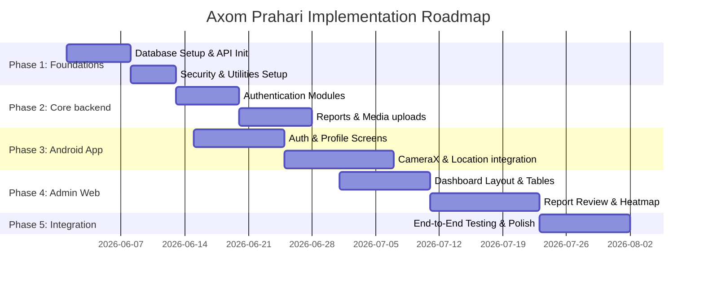

# Project Implementation Plan 🛡️
## Project: Axom Prahari (The Civic Sentinel)

This document outlines the phased plan to build, integrate, verify, and deploy the Axom Prahari platform. It details architectural steps, dependency tracking, verification tests, and deployment protocols.

---

## 1. Project Implementation Phases



---

## 2. Phase Breakdown

### Phase 1: Foundation & Setup
*   **Step 1.1: Database Schema Deployment:**
    *   Set up PostgreSQL instance.
    *   Execute `database.sql` to initialize tables (`users`, `violation_master`, `violation_reports`, `invalidated_tokens`, `admin_notifications`, `feedbacks`) and setup indexes.
*   **Step 1.2: API Server Initialization:**
    *   Create `api/v1/` directory.
    *   Initialize Node.js application, configure Express, Helmet, CORS, and Zod validator middleware.
    *   Setup `.env` configuration file with local and R2 targets.
*   **Step 1.3: Mobile App & Frontend Boilerplate Setup:**
    *   Configure Android gradle settings with 64-bit ABI filter, Compose, and Hilt.
    *   Initialize Next.js project with Tailwind CSS v4, Radix, and Lucide icons.

### Phase 2: Core Backend Engine Development
*   **Step 2.1: Authentication System:**
    *   Implement citizen verification using Twilio SMS API.
    *   Develop password hashing (BCrypt) and role verification controls for administrators.
    *   Implement JWT verification with `password_changed_at` check.
*   **Step 2.2: Reports & Cloudflare R2 Upload Gateway:**
    *   Configure AWS SDK for R2 credentials.
    *   Create endpoint `/api/v1/citizen/reports/presigned-url` to generate secure, brief-valid upload URLs.
    *   Create Zod validated reporting endpoint (`POST /api/v1/citizen/reports`).
*   **Step 2.3: Admin Management APIs:**
    *   Develop endpoints to perform CRUD actions on Police Admins and Citizens.
    *   Enforce security boundaries (e.g., block self-deactivation, Police Admin control boundaries).

### Phase 3: Citizen Android Application Development
*   **Step 3.1: Onboarding & Authentication UI:**
    *   Implement Compose screens for Onboarding, Request OTP, and Verify OTP.
    *   Develop ViewModel logic mapping UI state flow with Hilt dependency injection.
*   **Step 3.2: CameraX & Location Integration:**
    *   Build customized CameraX preview interface restricting uploads to live-shot photos/videos.
    *   Implement Android LocationManager to fetch geotagging details.
*   **Step 3.3: Reporting & History Feed UI:**
    *   Build the report submission form and background Retrofit upload tasks.
    *   Develop the Reports tab showing current status (`Pending`, `Accepted`, `Rejected`) and detail cards.

### Phase 4: Web Admin Dashboard Development
*   **Step 4.1: Authentication & Navigation Shell:**
    *   Build secure login page and auth-checking routing middleware.
    *   Build the global sidebar navigation shell.
*   **Step 4.2: Reports Management console:**
    *   Implement reporting list with paginated filters.
    *   Develop split-screen review console showcasing video playback, geocoded metadata, and acceptance controls.
*   **Step 4.3: Heatmap & Admin Config UIs:**
    *   Integrate Mapbox map displaying report cluster coordinates.
    *   Build master lists config panels for Violations list, Admins, and Citizens.

---

## 3. Integration & Testing Plan

### 3.1 Backend Integration Verification
Run verification scripts in `api/v1/` to validate schema logic:
```bash
# Verify Admin CRUD access boundary constraints
node verifyAdminCRUD.js

# Verify Citizen profile updates and username checks
node verifyCitizenProfileUpdate.js

# Verify Citizen dashboard statistics calculation logic
node verifyCitizenDashboardStats.js

# Verify Violations CRUD and updates
node verifyViolationUpdates.js
```

### 3.2 Automated Testing Specifications
*   **Backend Unit Tests:** Use Mocha/Chai or Jest to validate endpoints, authentication gates, and Zod inputs.
*   **Android Instrumental Tests:** Use Espresso or Compose Test Rule to verify OTP logins, camera preview loads, and form validation triggers.
*   **Web Dashboard UI Tests:** Use Playwright or Cypress to automate test scenarios for report accept/reject transitions and session invalidation on password change.

---

## 4. Deployment Plan

### 4.1 Production Hosting Structure
*   **Backend REST API:** Hosted on AWS Elastic Beanstalk or a containerized system (Docker) via ECS.
*   **Web Admin Dashboard:** Deployed directly on Vercel or Netlify for instant loading and preview builds.
*   **Database:** Managed PostgreSQL instance (e.g., AWS RDS or Supabase) with automated daily backups.
*   **Media Assets:** Cloudflare R2 bucket with custom CDN domain routing.

### 4.2 CI/CD Deployment Flow
1.  **Branch Check:** Push commits to `develop` or `main`.
2.  **Lint & Compile Tests:** GitHub Actions runs ESLint on JS, Gradle builds on Android, and TypeScript compilation checks on Next.js.
3.  **Docker Build & Upload:** Build Backend image and push to container registry.
4.  **Auto Deploy:** Trigger environment redeploys upon passing testing suite.
