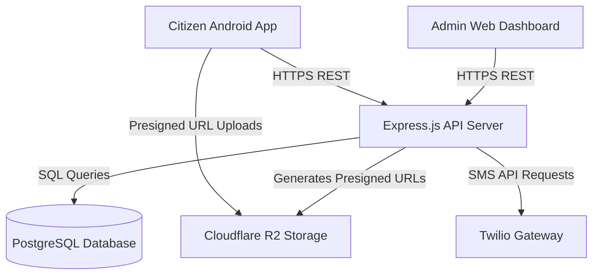

# Technical Requirements Document (TRD) 🛡️
## Project: Axom Prahari (The Civic Sentinel)

---

## 1. System Architecture Overview
Axom Prahari uses a monorepo architecture containing three primary systems:
1.  **Mobile Client:** Native Kotlin Android Application.
2.  **Web Portal:** Next.js 16 (React 19) Dashboard.
3.  **Core REST API:** Node.js/Express.js Server.
4.  **Database Layer:** PostgreSQL relational database.
5.  **Storage Layer:** Cloudflare R2 (S3-compatible) Object Storage.

---

## 2. Module Specifications

### 2.1 Citizen Android Application (`app/`)
*   **Targeting:** Min SDK 29 (Android 10), Target SDK 36 (Android 15+).
*   **Compile Architecture:** Restricted to 64-bit ABI filter (`arm64-v8a`, `x86_64`) via Gradle configurations.
*   **Core UI Library:** Jetpack Compose (Material 3) with dynamic light/dark theme adaptation.
*   **Camera Integration:** Jetpack CameraX API. Restricts capture to live photo/video mode (gallery uploads are blocked or strictly validated).
*   **Geospatial Tracking:** Google Location Services & Android `LocationManager` API for offline-ready coordinates acquisition.
*   **Networking:** Retrofit 2 + OkHttp 4 client.
*   **State Management & DI:** Dagger Hilt for dependency injection, Jetpack ViewModel, and Kotlin StateFlow.
*   **Local Storage:** Android DataStore for secure token storage.

### 2.2 Web Dashboard & Portal (`frontend/`)
*   **Framework:** Next.js 16 using App Router structure.
*   **Base Engine:** React 19.
*   **Styling Engine:** Tailwind CSS v4.
*   **Component Base:** Radix UI primitives with custom theme overlays (Shadcn UI wrapper patterns).
*   **Client Network:** Axios with global interceptors for auth headers injection.
*   **Icons:** Lucide React library.

### 2.3 Backend Server (`api/`)
*   **Runtime:** Node.js v18+.
*   **Framework:** Express.js utilizing ES modules (`import/export`).
*   **Database Client:** PostgreSQL client (`pg` module) with raw connection pooling.
*   **Authentication & Hashing:** JWT (JSON Web Tokens) with asymmetrical/symmetric keys and `bcrypt` for admin credentials.
*   **Validator:** Zod schemas.
*   **Media Gateway:** AWS S3 SDK v3 configured for Cloudflare R2 object store bucket.
*   **Third-party Integrations:** Twilio SMS APIs.
*   **Security:** Helmet.js headers, Express Rate Limit, and CORS configuration.

---

## 3. Database Schema Design (PostgreSQL)
The database contains 5 core relational tables and supporting indexes:

1.  **`users`**: Unified table mapping citizens, police admins, and super admins.
2.  **`invalidated_tokens`**: Blacklist table storing logged-out or invalidated JWTs.
3.  **`violation_master`**: Catalog of traffic violations, MV acts, and associated details.
4.  **`violation_reports`**: Detailed citizen submissions (links to user and violation master).
5.  **`admin_notifications`**: System notifications targeted by roles and districts.
6.  **`feedbacks`**: Citizen feedback registry.

---

## 4. Key API Endpoints & Interfaces
Refer to [API_DOCS.md](file:///E:/AxomPrahari/API_DOCS.md) for full endpoint structures.

### 4.1 Authentication Flows
*   **Citizen OTP Flow:**
    *   `POST /api/v1/auth/citizen/request-otp` -> Returns validation challenge or triggers Twilio SMS.
    *   `POST /api/v1/auth/citizen/verify-otp` -> Validates SMS response, registers user, issues Citizen JWT.
*   **Admin Credential Flow:**
    *   `POST /api/v1/auth/admin/login` -> Compares passwords, issues Admin JWT.

### 4.2 Reports Management Flow
*   `GET /api/v1/citizen/reports/presigned-url` -> Returns an S3 upload URL.
*   `POST /api/v1/citizen/reports` -> Captures submission data.
*   `PATCH /api/v1/admin/reports/:id/review` -> Modifies status (`pending`, `accepted`, `rejected`) and logs remarks.

---

## 5. Security & Access Control Boundaries

### 5.1 Admin Role Hierarchy
The backend enforces strict validation boundaries for administrative interactions:
*   **`police_admin`** (District Officer):
    *   Can create or edit other `police_admin` profiles in the system.
    *   Has zero authority over `super_admin` profiles (cannot view, edit, toggle status, or delete them).
    *   Cannot create a `super_admin` profile.
*   **`super_admin`** (System Overseer):
    *   Full administrative permissions.
    *   Can manage `police_admin` and other `super_admin` accounts.

### 5.2 Self-Operations Restriction
Regardless of role, no administrator can delete or disable their own account.
*   `DELETE /api/v1/admin/:id` yields `403 Forbidden` if `:id` matches current authenticated ID.
*   `PATCH /api/v1/admin/:id/status` yields `403 Forbidden` if `:id` matches current authenticated ID.

### 5.3 Active Token Expiry
If an administrator changes their password:
1.  The backend sets `password_changed_at` to the current timestamp.
2.  All existing JWT tokens issued before this timestamp fail validation (`iat` < `password_changed_at`).
3.  The client receives a `401 Unauthorized` response and initiates a logout redirect.

---

## 6. Infrastructure & Deployment Environment

### 6.1 Environment Variables Configuration

#### Backend Env (`api/v1/.env`)
*   `PORT`: Port of the express server.
*   `DATABASE_URL`: PostgreSQL connection string.
*   `JWT_SECRET`: Secret key for signing tokens.
*   `TWILIO_ACCOUNT_SID` & `TWILIO_AUTH_TOKEN`: Twilio service credentials.
*   `TWILIO_VERIFY_SERVICE_SID`: Twilio Verify SID for OTP.
*   `R2_ACCESS_KEY_ID` & `R2_SECRET_ACCESS_KEY`: Cloudflare R2 credentials.
*   `R2_ENDPOINT`: Cloudflare endpoint URL.
*   `R2_BUCKET_NAME`: R2 target bucket.
*   `ALLOWED_ORIGINS`: Commas-separated list of frontends allowed to fetch data.

#### Frontend Env (`frontend/.env`)
*   `NEXT_PUBLIC_API_URL`: Path to the core Node.js server API.
*   `NEXT_PUBLIC_MAPBOX_TOKEN`: Mapbox API token for dashboard rendering (heatmap).

---

## 7. Performance & Quality Benchmarks
*   **ABI Compilations:** Native C++ compilations are limited to 64-bit filters to reduce mobile bundle size.
*   **Image Compression:** Citizen App compresses photos using JPEG compression before uploading to Cloudflare R2.
*   **API Latency:** Target response time for critical paths (OTP verification, dashboard fetches) is `<200ms` under normal loads.
*   **Logging:** Winston or standard node outputs with timestamped prefixes.
